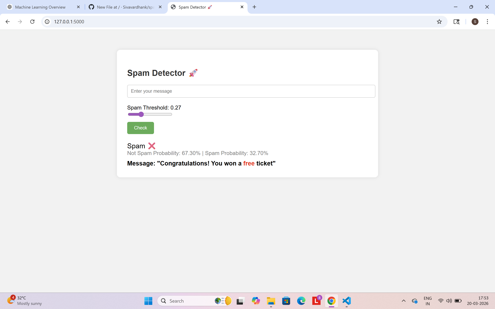

# Spam Detector 🚀

A Python Flask web app that detects **spam messages** using **Random Forest** and **TF-IDF vectorization**.  
This project is **mini but portfolio-ready**, demonstrating Machine Learning, Python, and web development skills.

---

## Features
- Predicts **Spam ❌ / Not Spam ✅**
- Shows **confidence/probability** for each prediction
- Highlights **spammy words in red**
- Adjustable **threshold slider** for sensitivity
- Automatic **spell correction** to catch typos
- Simple, clean, and professional **web interface**

---

## Demo

  
*Screenshot of the app running locally with prediction results.*

---

## How to Run Locally

1. **Clone the repository**:

```bash
git clone <YOUR_REPO_URL>
cd spam_project

SMS Spam Collection Dataset on Kaggle

(Used to train the model)

Technologies Used

Python 3.x

Flask (Web Framework)

scikit-learn (Logistic Regression)

pandas (Data handling)

numpy (Numerical operations)

TF-IDF Vectorizer (Text feature extraction)

Future Improvements

Deploy online using Heroku / Render / Streamlit Cloud

Use deep learning models for better accuracy

Integrate with email clients for real-world spam detection

Add more advanced NLP preprocessing (emoji handling, stopwords, etc.)
Notes

Model predicts based on patterns learned from the dataset

Short messages or unusual phrasing may sometimes be misclassified

Threshold can be adjusted in-app for sensitivity control

Spell correction improves detection for messages with typos

GitHub: https://github.com/Sivavardhank
Email: shivavardhank2@gmail.com
